## Advanced Lane Finding Project

The goals / steps of this project are the following:
* Compute the camera calibration matrix and distortion coefficients given a set of chessboard images.
* Apply a distortion correction to raw images.
* Use color transforms, gradients, etc., to create a thresholded binary image.
* Apply a perspective transform to rectify binary image ("birds-eye view").
* Detect lane pixels and fit to find the lane boundary.
* Determine the curvature of the lane and vehicle position with respect to center.
* Warp the detected lane boundaries back onto the original image.
* Output visual display of the lane boundaries and numerical estimation of lane curvature and vehicle position.

## Submission notes

## Rubric #1: Camera Calibration
1) Briefly state how you computed the camera matrix and distortion coefficients. Provide an example of a distortion corrected calibration image.
* step 1 - I identified object and image points in the calibration chessboard images.
* step 2 - Read in the images using cv2.imread.
* step 3 - Then used cv2.drawChessboardCorners to draw corners.
* step 4 - Saved corner files and camera calibration data.
* step 5 - Used the camera calibration data to undistort the images using cv2.undistort.
* step 6 - Image can be seen as undistorted_chessboard.jpg.

## Rubric #2: Pipeline(test images)
2) Provide an example of a distortion-corrected image.
* Distortion-corrected test image can be seen in './test_images/corrected_test1.jpg'

3) Describe how (and identify where in your code) you used color transforms, gradients or other methods to create a thresholded binary image. Provide an example of a binary image result.
* Code is located in 'helper.py' - line 49-105
    * For color transforms...
    * I thresholded the L-channel of HLS using 201 and 255 as boundaries
    * I thresholded the B-channel of LAB using 145 and 255 as boundaries
    * I combined both color binary spaces
* For gradients...
    * I converted the images to grayscale
    * Calculated the Sobel X gradient using cv2.Sobel and kernal size 5
* Lastly, I combined both the color and grdient thresholds


4) Describe how (and identify where in your code) you performed a perspective transform and provide an example of a transformed image.
* Code is located in 'helper.py' - line 42-46
    * I calculated the perspective transform on the source and destination points and warped the image


5) Describe how (and identify where in your code) you identified lane-line pixels and fit their positions with a polynomial?
* Code is located in 'helper.py' - line 107-206
* For lane-line pixel identification...
    * I utilized convolution techniques
    * I located the lane lines by taking a histogram of the lower part of the binary warped images
    * I found the peak of the left and right halves of the histogram; the starting point for the left and right lines
    * I chose the number of sliding windows and set the height
    * Then I identified the non-zero pixles within the sliding windows
    * I created a list of nonzero pixles and extracted left and right positions
* For polynomial fit...
    * I defined conversions in x and y from pixels space to meters
    * Then I fit new polynomials to x,y in world space
    
6) Describe how (and identify where in your code) you calculated the radius of curvature of the lane and the position of the vehicle with respect to center.
* Code is located in 'helper.py' - line 322-380
* For radius of curvature...
    * I used the warped image and the polynomial perameters to calculate the radius
    * I checked the lines by checking their respective curvature and slopes

7) Provide an example image of your result plotted back down onto the road such that the lane area is identified clearly.
* Sample image can be found in 'test_images' folder or down below

## Rubric #3: Pipeline(video)
8) Provide a link to your final video output. Your pipeline should perform reasonably well on the entire project video (wobbly lines are ok but no catastrophic failures that would cause the car to drive off the road!)
* Videos can be found in files...
    * test.mp4, test_harder.mp4, test_challenge.mp4

## Rubric #4: Discussion
9) Briefly discuss any problems / issues you faced in your implementation of this project. Where will your pipeline likely fail? What could you do to make it more robust?
* I faced problems in creating my binary images. Images would be all black or noisy.  Color spaces also posed a challenge because it was difficult to guage the ralational aspects of the thresholds.  I had to use a color selector to find the right values.  
* I faced problems in identifying the lane lines and drawing the polynomials. At first the lines were identified, but the sliding window wasn't positioned correctly. I had to seek help from the forum and slack channels.
* Pipeline will likely fail when driving through a tunnel or very low light scenarios, additional thresholding techniques could help or using other sensor inputs.


---
## 1. Use chessboard to calibrate the camera


```python
import numpy as np
import cv2
import glob
import helper
import matplotlib.pyplot as plt
%matplotlib inline

objp = np.zeros((6*9,3), np.float32)
objp[:,:2] = np.mgrid[0:9,0:6].T.reshape(-1,2)

objpoints = [] 
imgpoints = [] 

images = glob.glob('camera_cal/calibration*.jpg')

for index, fname in enumerate(images):
    img = cv2.imread(fname)
    gray = cv2.cvtColor(img,cv2.COLOR_BGR2GRAY)

    ret, corners = cv2.findChessboardCorners(gray, (9,6),None)

    if ret == True:
        objpoints.append(objp)
        imgpoints.append(corners)

        img = cv2.drawChessboardCorners(img, (9,6), corners, ret)
        fig = plt.figure(figsize=(18,8))
        plt.subplot(121),plt.imshow(gray,'gray'),plt.title('ORIGINAL')
        plt.subplot(122),plt.imshow(img,'gray'),plt.title('UNDISTORTED')
        
        result = img
        write_name = './camera_cal/corners_'+str(index)+'.jpg'
        cv2.imwrite(write_name,result)
        
ret, mtx, dist, rvecs, tvecs = cv2.calibrateCamera(objpoints, imgpoints, gray.shape[::-1],None,None)
print('saved corner files')
```

    saved corner files


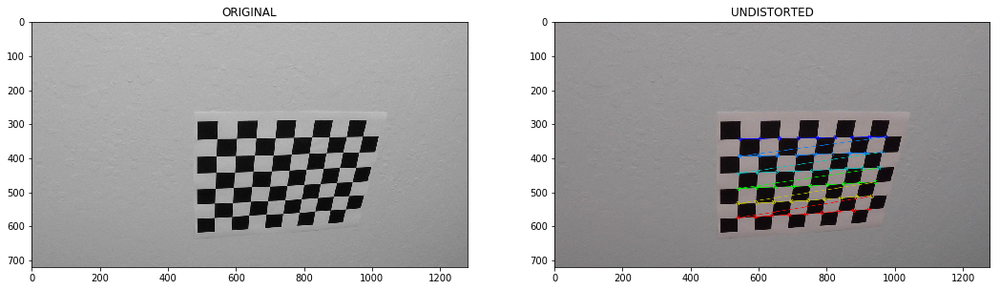


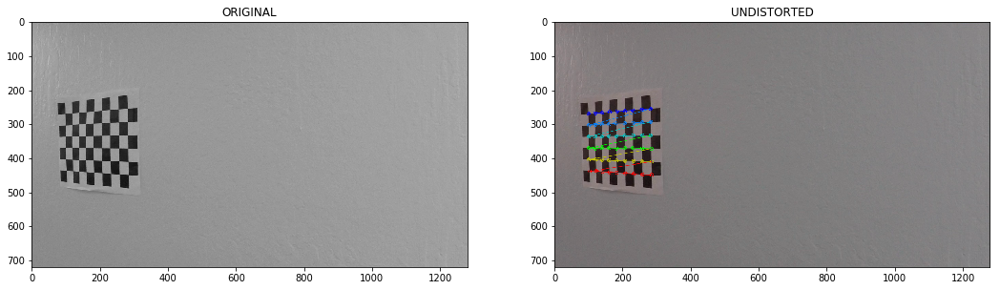


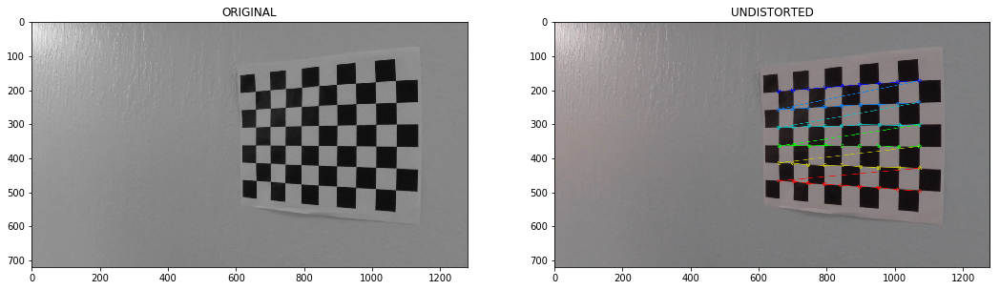


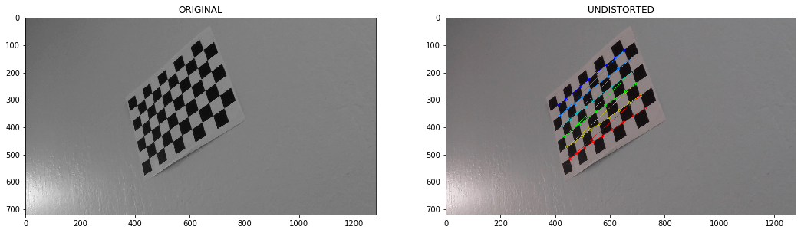


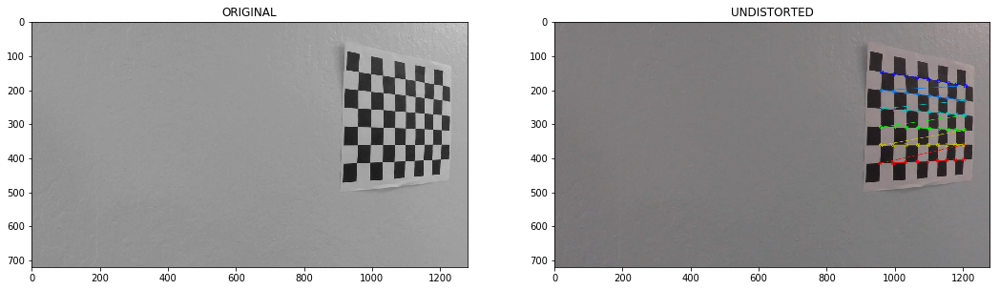


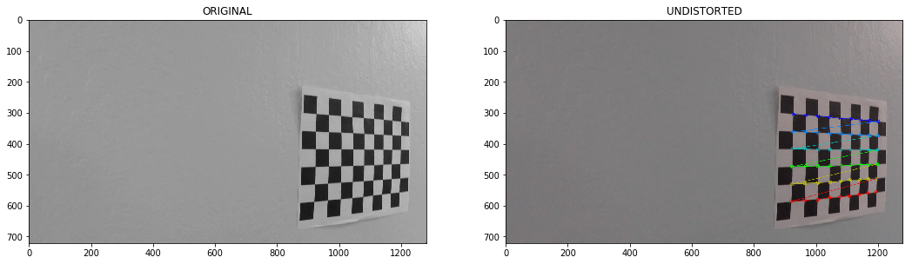


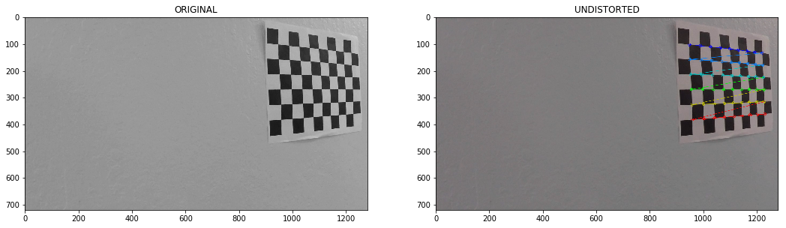


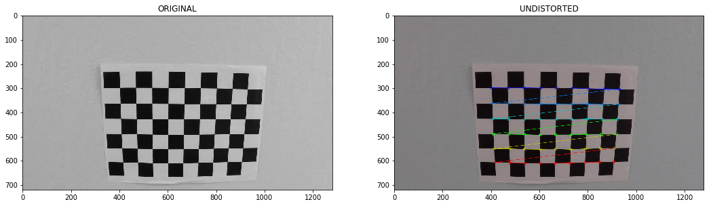


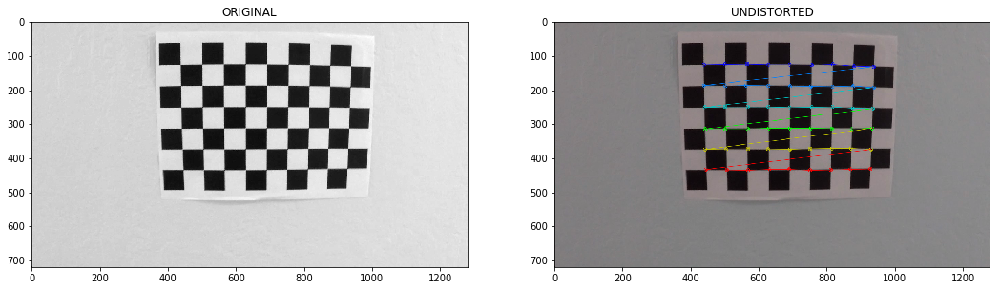


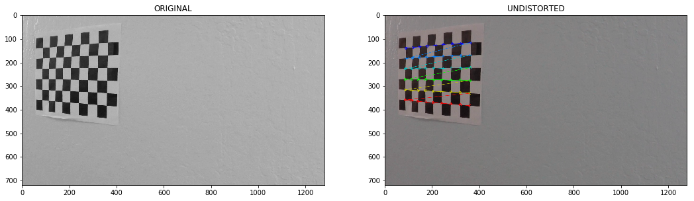


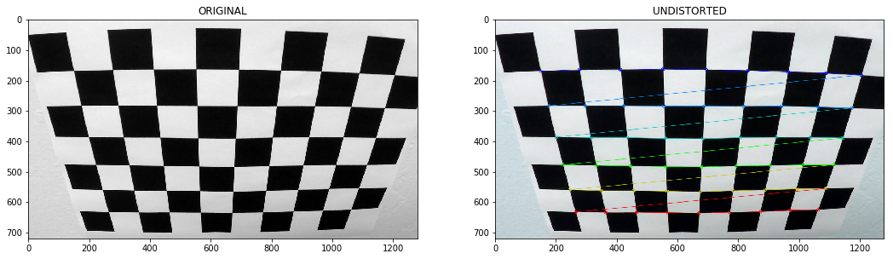


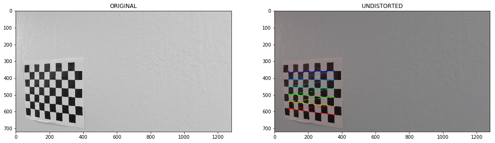


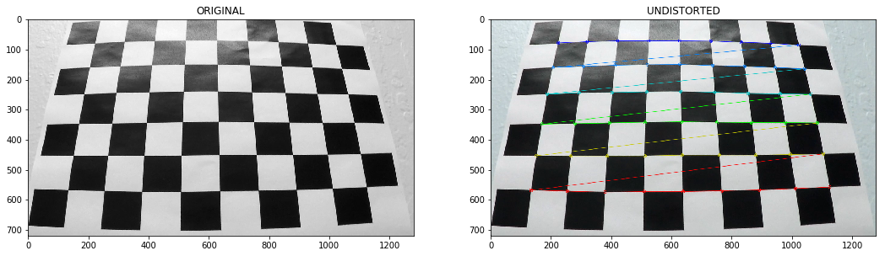


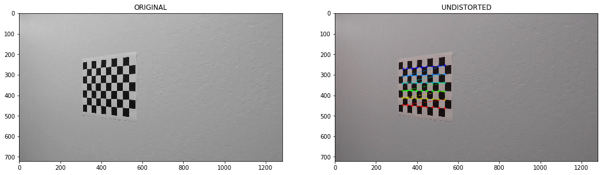


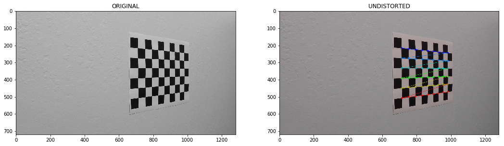


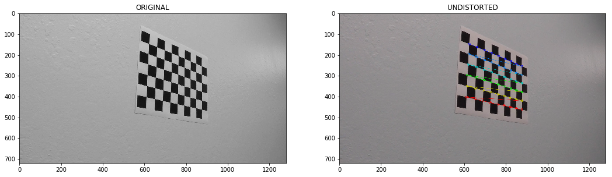


## 2. Use the camera calibration to correct chessboard distortion


```python
img = cv2.imread('camera_cal/calibration1.jpg')
dst = helper.undistort(img, mtx, dist)
fig = plt.figure(figsize=(18,8))
plt.subplot(121),plt.imshow(img,'gray'),plt.title('ORIGINAL')
plt.subplot(122),plt.imshow(dst,'gray'),plt.title('UNDISTORTED')

cv2.imwrite('./camera_cal/undistorted_chessboard.jpg', dst)
print('undistorted chessboard saved')
```

    undistorted chessboard saved


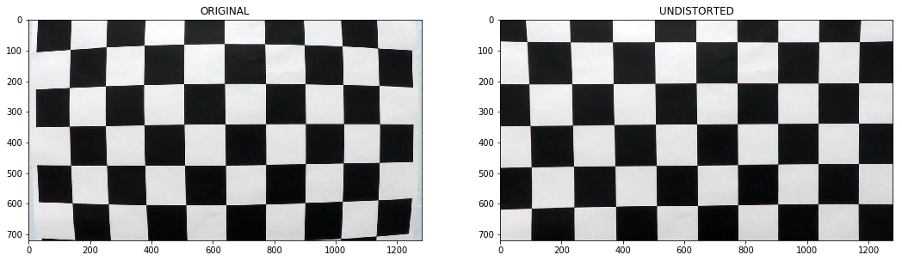


## 3. Show distortion-corrected test images


```python
# Make a list of test images
images = glob.glob('test_images/test*.jpg')

for index, fname in enumerate(images):
    img = cv2.imread(fname)
    img = cv2.cvtColor(img, cv2.COLOR_BGR2RGB)
    dst = helper.undistort(img, mtx, dist)
    fig = plt.figure(figsize=(18,8))
    plt.subplot(121),plt.imshow(img),plt.title('ORIGINAL')
    plt.subplot(122),plt.imshow(dst),plt.title('UNDISTORTED')
    
    result = dst
    write_name = './test_images/corrected_'+str(index)+'.jpg'
    cv2.imwrite(write_name,result)
        
print('saved corrected test images')
```

    saved corrected test images


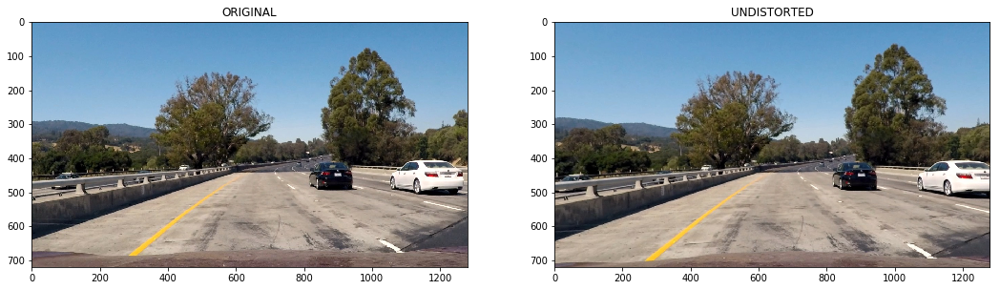


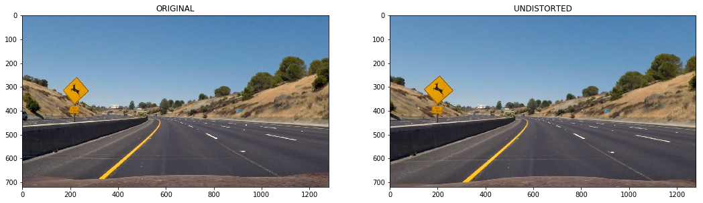


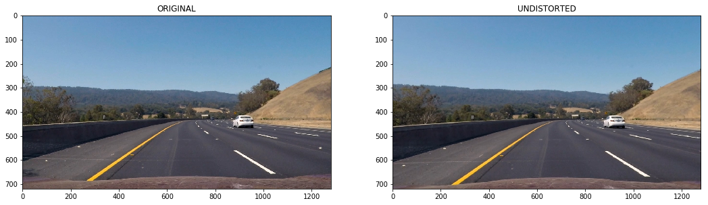


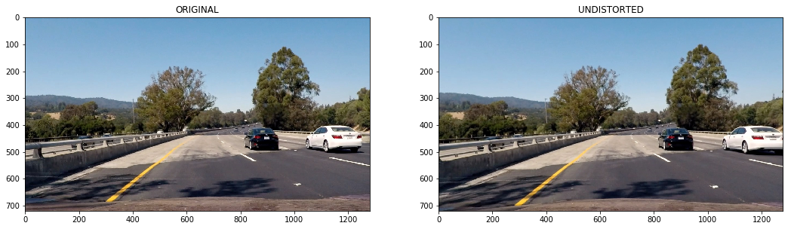


## Show distortion-corrected straight-lines images


```python
# Make a list of test images
images = glob.glob('test_images/straight_lines*.jpg')

for fname in images:
    img = cv2.imread(fname)
    img = cv2.cvtColor(img, cv2.COLOR_BGR2RGB)
    dst = helper.undistort(img, mtx, dist)
    fig = plt.figure(figsize=(18,8))
    plt.subplot(121),plt.imshow(img),plt.title('ORIGINAL')
    plt.subplot(122),plt.imshow(dst),plt.title('UNDISTORTED')
```


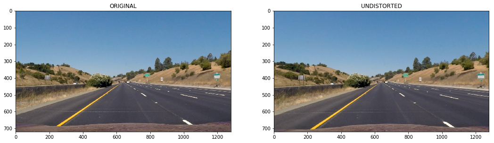


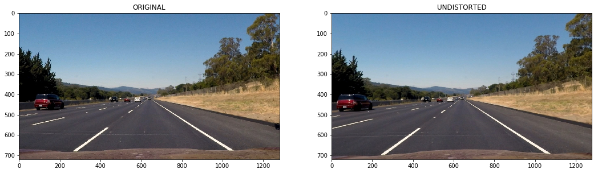


## 5. Warp straight-lines images


```python
fig = plt.figure(figsize=(18,8))
plt.imshow(dst)
plt.plot(550, 460, '.')
plt.plot(730, 460, '.')
plt.plot(1280, 700, '.')
plt.plot(0, 700, '.')
```


    [<matplotlib.lines.Line2D at 0x11c94f940>]


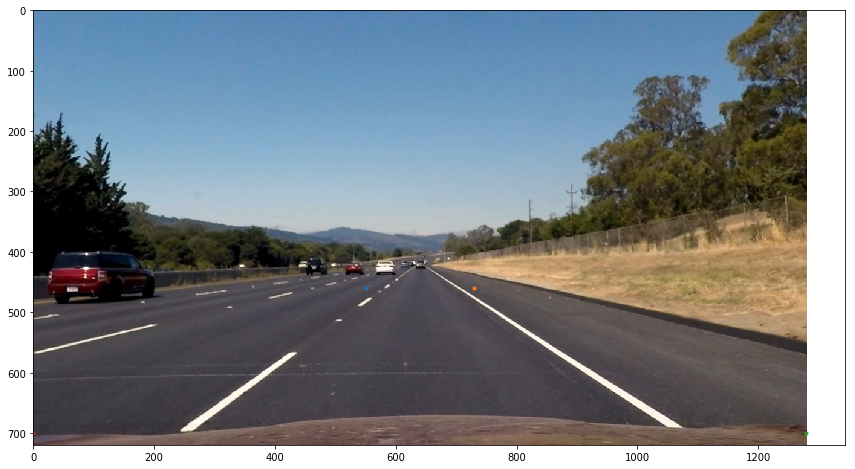


## Show perspective-transformed straight-lines images


```python
images = glob.glob('test_images/straight_lines*.jpg')

for index, fname in enumerate(images):
    img = cv2.imread(fname)
    img = cv2.cvtColor(img, cv2.COLOR_BGR2RGB)
    dst = helper.undistort(img, mtx, dist)
    dst,_ = helper.warp(dst)
    fig = plt.figure(figsize=(18,8))
    plt.subplot(121),plt.imshow(img),plt.title('ORIGINAL')
    plt.subplot(122),plt.imshow(dst),plt.title('UNDISTORTED & WARPED')
    
    dst = cv2.cvtColor(dst, cv2.COLOR_BGR2RGB)
    result = dst
    write_name = './test_images/perspective_transformed_corrected_'+str(index)+'.jpg'
    cv2.imwrite(write_name,result)
        
print('saved perspective transformed straight lines')
```

    saved perspective transformed straight lines


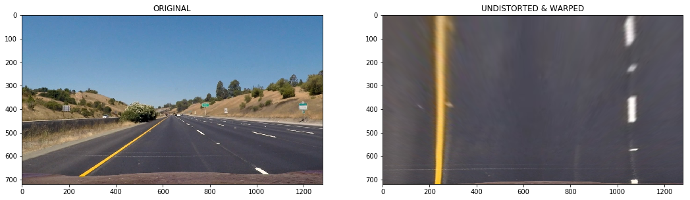


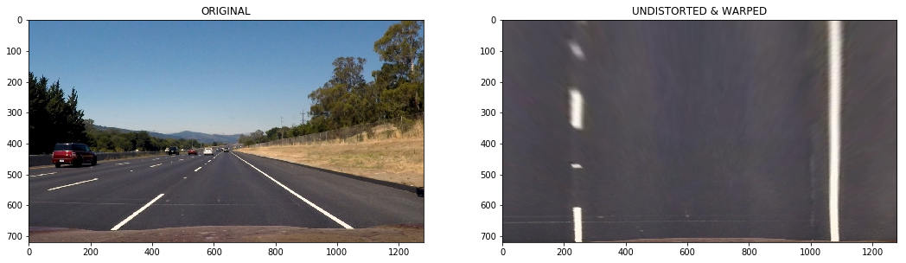


## Show perspective-transformed test images


```python
# Make a list of test images
images = glob.glob('test_images/test*.jpg')
for index, fname in enumerate(images):
    img = cv2.imread(fname)
    img = cv2.cvtColor(img, cv2.COLOR_BGR2RGB)
    dst = helper.undistort(img, mtx, dist)
    dst,_ = helper.warp(dst)
    fig = plt.figure(figsize=(18,8))
    plt.subplot(121),plt.imshow(img),plt.title('ORIGINAL')
    plt.subplot(122),plt.imshow(dst),plt.title('UNDISTORTED & WARPED')
    
    dst = cv2.cvtColor(dst, cv2.COLOR_RGB2BGR)
    result = dst
    write_name = './test_images/perspective_transformed_warped_'+str(index)+'.jpg'
    cv2.imwrite(write_name,result)
        
print('saved perspective transformed test images')
```

    saved perspective transformed test images


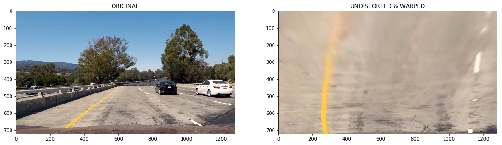


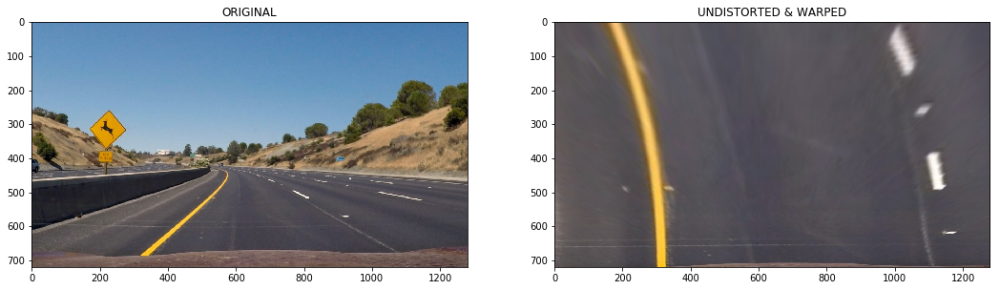


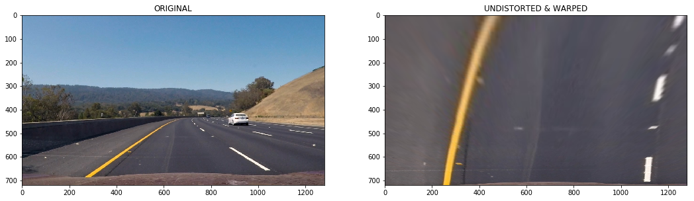


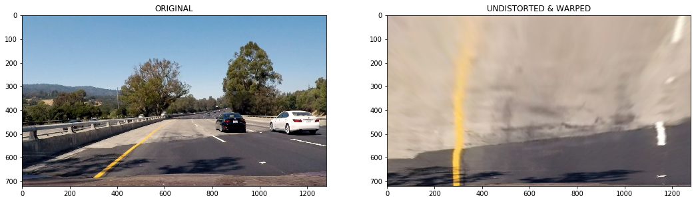


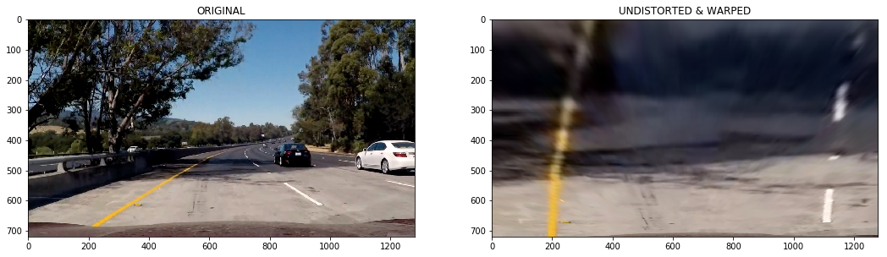


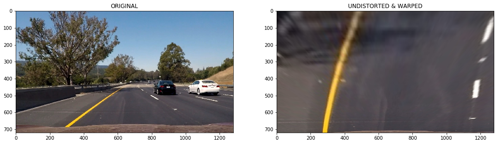


## 6. Create thresholded binary images: based on colorspace channels


```python
images = glob.glob('test_images/test*.jpg')

for index, fname in enumerate(images):
    img = cv2.imread(fname)
    img = cv2.cvtColor(img, cv2.COLOR_BGR2RGB)
    img = helper.undistort(img, mtx, dist)
    img,_ = helper.warp(img)
    dst1,dst2,dst3 = helper.color_thred(img)
    fig = plt.figure(figsize=(18,8))
    plt.subplot(141),plt.imshow(img),plt.title('WARPED')
    plt.subplot(142),plt.imshow(dst1,'gray'),plt.title('HLS - L')
    plt.subplot(143),plt.imshow(dst2,'gray'),plt.title('LAB - B')
    plt.subplot(144),plt.imshow(dst3,'gray'),plt.title('Combined')
    
    
print('saved all perspective transformed test images')
```

    saved all perspective transformed test images


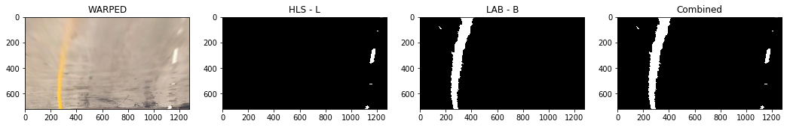


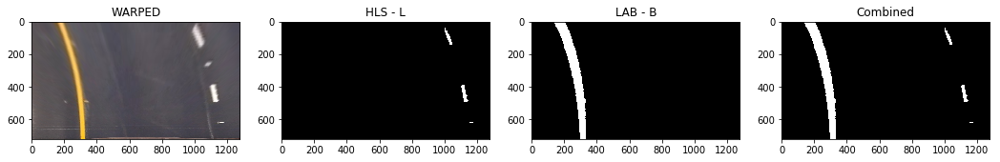


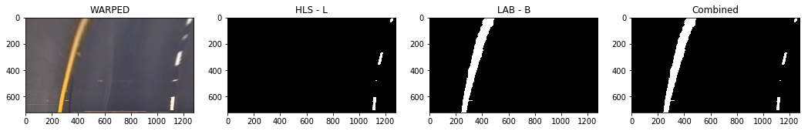


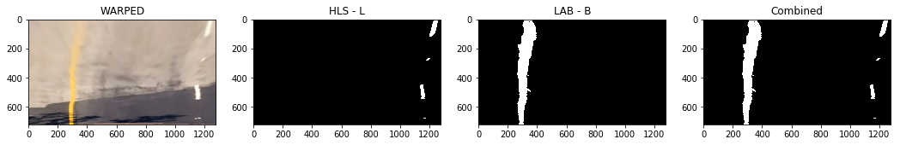


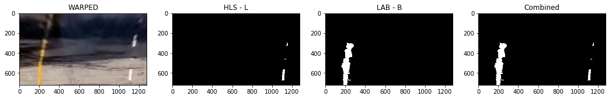


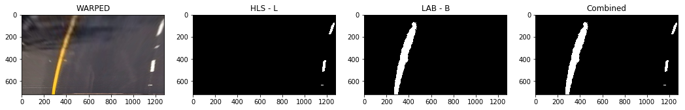


## Create thresholded binary images: based on Sobel gradients


```python
images = glob.glob('test_images/test*.jpg')
for index, fname in enumerate(images):
    img = cv2.imread(fname)
    img = cv2.cvtColor(img, cv2.COLOR_BGR2RGB)
    img = helper.undistort(img, mtx, dist)
    img,_ = helper.warp(img)
    dst = helper.grad_thred(img)
    fig = plt.figure(figsize=(18,8))
    plt.subplot(121),plt.imshow(img),plt.title('WARPED')
    plt.subplot(122),plt.imshow(dst,'gray'),plt.title('Gradient x')
    
print('saved Sobel gradients')
```


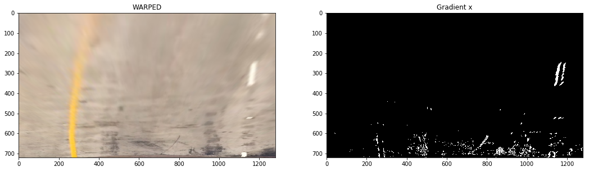


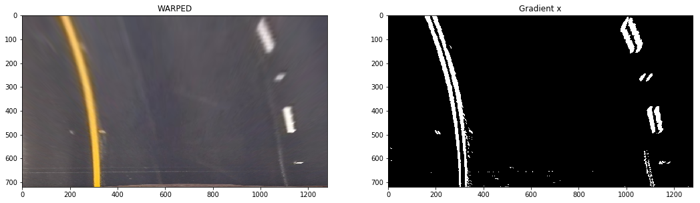


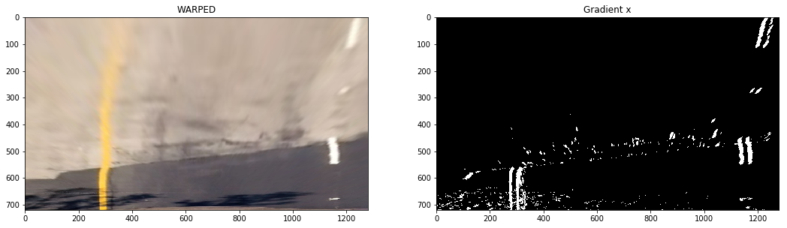


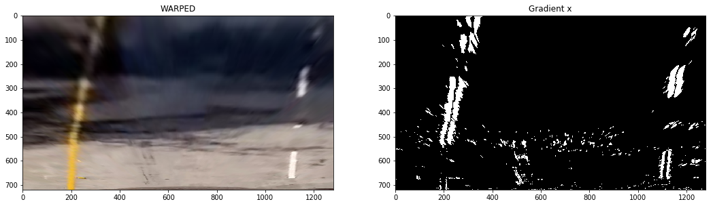


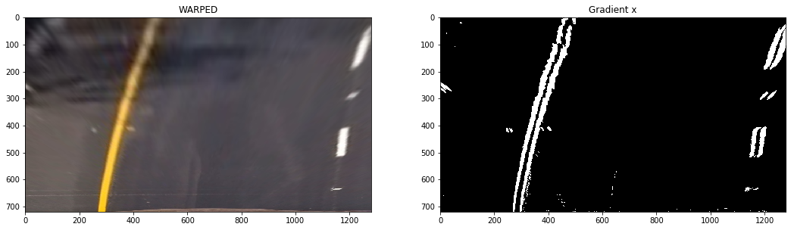


## Combine thresholded binary images based on colorspaces and gradients


```python
images = glob.glob('test_images/test*.jpg')
for index, fname in enumerate(images):
    img = cv2.imread(fname)
    img = cv2.cvtColor(img, cv2.COLOR_BGR2RGB)
    img = helper.undistort(img, mtx, dist)
    img,_ = helper.warp(img)
    dst = helper.combine_threds(img)
    fig = plt.figure(figsize=(18,8))
    plt.subplot(121),plt.imshow(img),plt.title('WARPED')
    plt.subplot(122),plt.imshow(dst,'gray'),plt.title('Combined threshold')
    
print('saved all Combined Threshold test images')
```

    saved all Combined Threshold test images


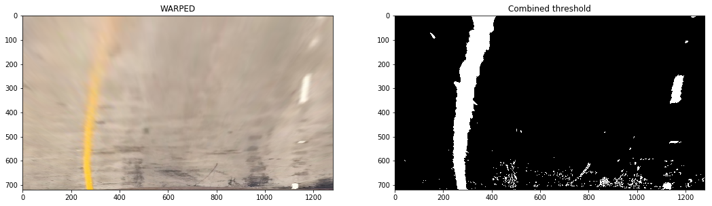


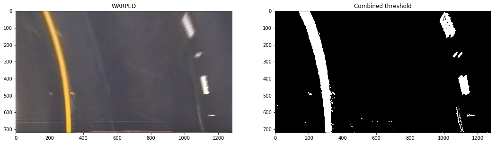


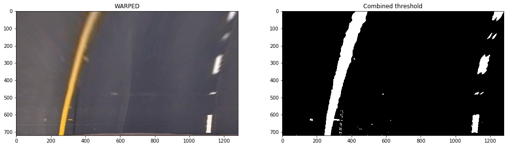


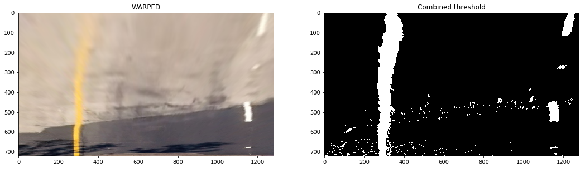


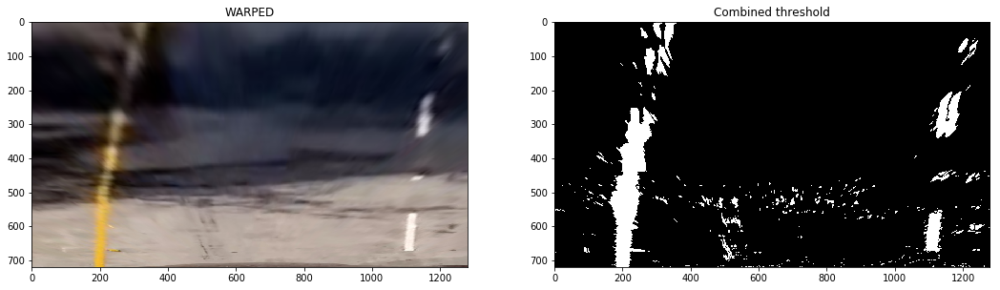


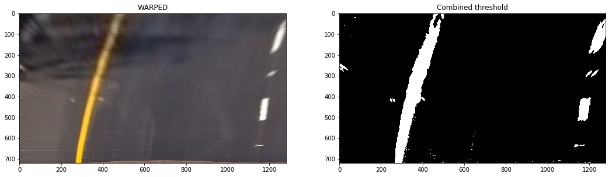


## 7. Find lane lines, and fit polynomials of lines


```python
images = glob.glob('test_images/test*.jpg')
for fname in images:
    img = cv2.imread(fname)
    img = cv2.cvtColor(img, cv2.COLOR_BGR2RGB)
    img = helper.undistort(img, mtx, dist)
    img,_ = helper.warp(img)
    img = helper.combine_threds(img)
    leftx, lefty, rightx, righty = helper.locate_lanes(img)
    left_fit, right_fit = helper.fit_poly(leftx, lefty, rightx, righty)
    result, ploty, left_fitx, right_fitx = helper.fit_poly_plot(
        img, left_fit, right_fit, leftx, lefty, rightx, righty)
    fig = plt.figure(figsize=(18,8))
    plt.subplot(121),plt.imshow(img,'gray'),plt.title('WARPED')
    plt.subplot(122),plt.imshow(result),plt.title('LANE LINES FOUND')
    plt.plot(left_fitx, ploty, color='yellow')
    plt.plot(right_fitx, ploty, color='yellow')
```


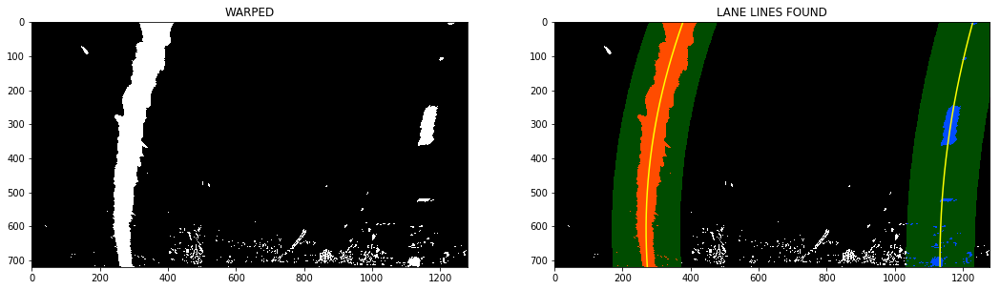


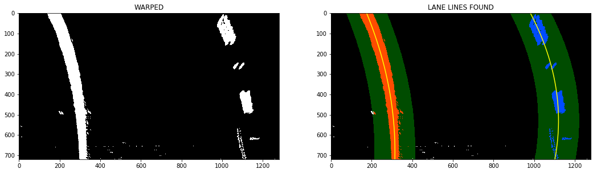


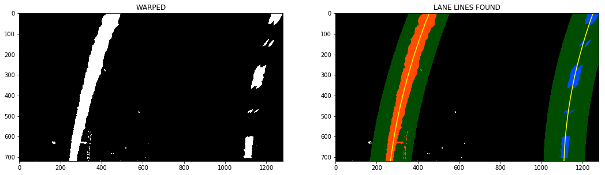


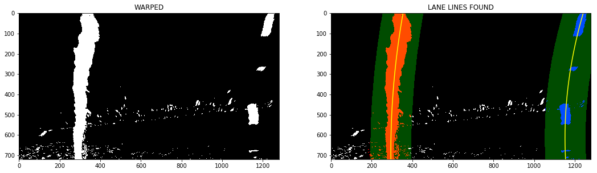


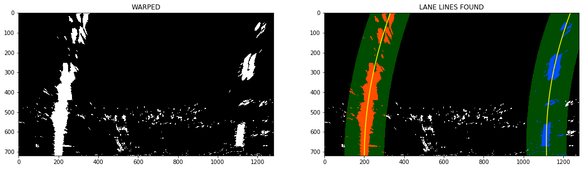


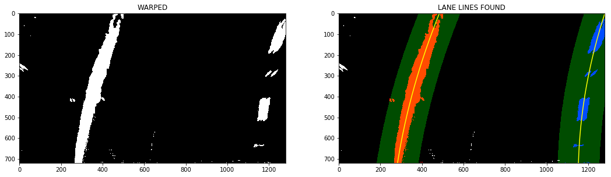


## 8. Project fitted lines to orginal images


```python
images = glob.glob('test_images/test*.jpg')
for fname in images:
    img = cv2.imread(fname)
    img = cv2.cvtColor(img, cv2.COLOR_BGR2RGB)
    img0 = helper.undistort(img, mtx, dist)
    img, Minv = helper.warp(img0)
    img = helper.combine_threds(img)
    leftx, lefty, rightx, righty = helper.locate_lanes(img)
    left_fit, right_fit = helper.fit_poly(leftx, lefty, rightx, righty)
    left_fit_m, right_fit_m = helper.fit_poly_m(leftx, lefty, rightx, righty)
    _, ploty, left_fitx, right_fitx = helper.fit_poly_plot(img, left_fit, right_fit, leftx, lefty, rightx, righty)
    result = helper.project_lines(img0, img, Minv, ploty, left_fitx, right_fitx)
    left_curverad, right_curverad = helper.get_curv_m(img, left_fit_m, right_fit_m)
    curverad = (left_curverad + right_curverad) / 2
    left2c, right2c = helper.dist2center_m(img, left_fit, right_fit)
    if left2c < right2c: str_side = 'left'
    else: str_side = 'right'
    fig = plt.figure(figsize=(18,8))
    font = {'family': 'sans-serif',
            'color':  'white',
            'weight': 'bold',
            'size': 'xx-large',
           }
    plt.subplot(121),plt.imshow(img0),plt.title('ORIGINAL')
    plt.subplot(122),plt.imshow(result),plt.title('PROJECTED LANES')
    plt.text(100, 50, 'Radius of Curvature = {:.0f}m'.format(curverad), fontdict=font)
    plt.text(100, 100, 'Vehicle is {:.2f}m {:s} of center'.
             format(np.absolute((right2c-left2c)/2.), str_side), fontdict=font)
```


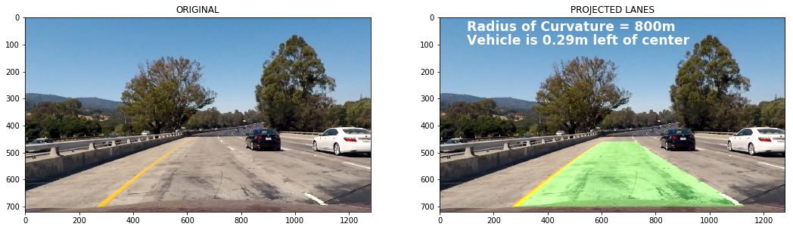


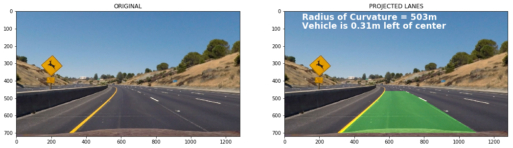


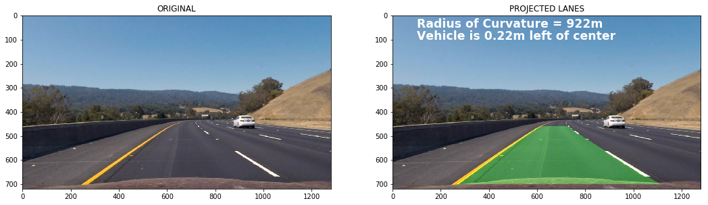


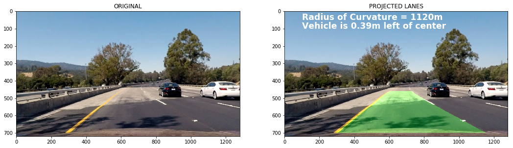


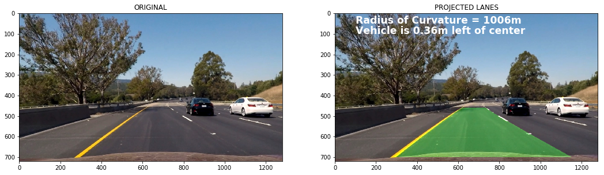


## 9. Process videos


```python
# Import everything needed to edit/save/watch video clips
from moviepy.editor import VideoFileClip
from IPython.display import HTML
import line

def process_image(img):
    return helper.process_image(img, mtx, dist, left, right)
```


```python
left = line.Line()
right = line.Line()
video_output = 'test.mp4'
clip1 = VideoFileClip("project_video.mp4")
video_clip = clip1.fl_image(process_image)
%time video_clip.write_videofile(video_output, audio=False)
```

    [MoviePy] >>>> Building video test.mp4
    [MoviePy] Writing video test.mp4


    100%|█████████▉| 1260/1261 [02:35<00:00,  9.39it/s]


    [MoviePy] Done.
    [MoviePy] >>>> Video ready: test.mp4 
    
    CPU times: user 3min 28s, sys: 36.3 s, total: 4min 5s
    Wall time: 2min 36s


```python
HTML("""
<video width="960" height="540" controls>
  <source src="{0}">
</video>
""".format(video_output))
```


<video width="960" height="540" controls>
  <source src="test.mp4">
</video>


## Challenge video


```python
left = line.Line()
right = line.Line()
video_output = 'test_challenge.mp4'
clip1 = VideoFileClip("challenge_video.mp4")
video_clip = clip1.fl_image(process_image)
%time video_clip.write_videofile(video_output, audio=False)
```

    [MoviePy] >>>> Building video test_challenge.mp4
    [MoviePy] Writing video test_challenge.mp4


    100%|██████████| 485/485 [00:50<00:00,  9.60it/s]


    [MoviePy] Done.
    [MoviePy] >>>> Video ready: test_challenge.mp4 
    
    CPU times: user 1min 12s, sys: 11.3 s, total: 1min 23s
    Wall time: 50.8 s


```python
HTML("""
<video width="960" height="540" controls>
  <source src="{0}">
</video>
""".format(video_output))
```


<video width="960" height="540" controls>
  <source src="test_challenge.mp4">
</video>


## Harder challenge video


```python
left = line.Line()
right = line.Line()
video_output = 'test_harder.mp4'
clip1 = VideoFileClip("harder_challenge_video.mp4")
video_clip = clip1.fl_image(process_image)
%time video_clip.write_videofile(video_output, audio=False)
```

    [MoviePy] >>>> Building video test_harder.mp4
    [MoviePy] Writing video test_harder.mp4


    100%|█████████▉| 1199/1200 [02:45<00:00,  8.40it/s]


    [MoviePy] Done.
    [MoviePy] >>>> Video ready: test_harder.mp4 
    
    CPU times: user 3min 34s, sys: 35.7 s, total: 4min 10s
    Wall time: 2min 46s


```python
HTML("""
<video width="960" height="540" controls>
  <source src="{0}">
</video>
""".format(video_output))
```


<video width="960" height="540" controls>
  <source src="test_harder.mp4">
</video>


